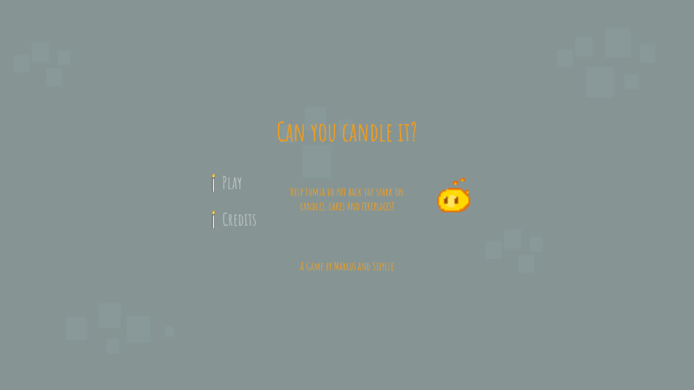

# Can You Candle It?

:fire: :fire: :fire: *The result of 2 beginners trying to make a game in 12 hours.*:fire: :fire: :fire:

You play as Lumia, a little ember, who only wants to set things on fire before she goes out.
By traversing platform puzzle levels, you reach your goal and light: a candle, a birthday cake, and a fireplace! You can navigate the game by using the arrow or WASD keys and spacebar to jump! 

Check out the game on [itch.io](https://s-ibylle.itch.io/can-you-candle-it)

Or check out the Jam Sandwich [presentation](https://docs.google.com/presentation/d/18tMI3jfCujatp72VHVmg8kXmeD4n82tJazXUM0zM3dM/edit?usp=sharing)

OR... Listen to us talk about the game on [YouTube](https://www.youtube.com/watch?v=O3Y2f50fZv0)

## Credits:
Music: DL Royalty Free Music
Game Assets: OpenGameArt and Kenney.nl
Cake and Candle Asset: MadMarcel on OpenGameArt
Fireplace Asset: Summer Thaxton and Stafford McIntyre

Added after the 12 hour Game Jam:
- Colliders on the left hand side
- Music
